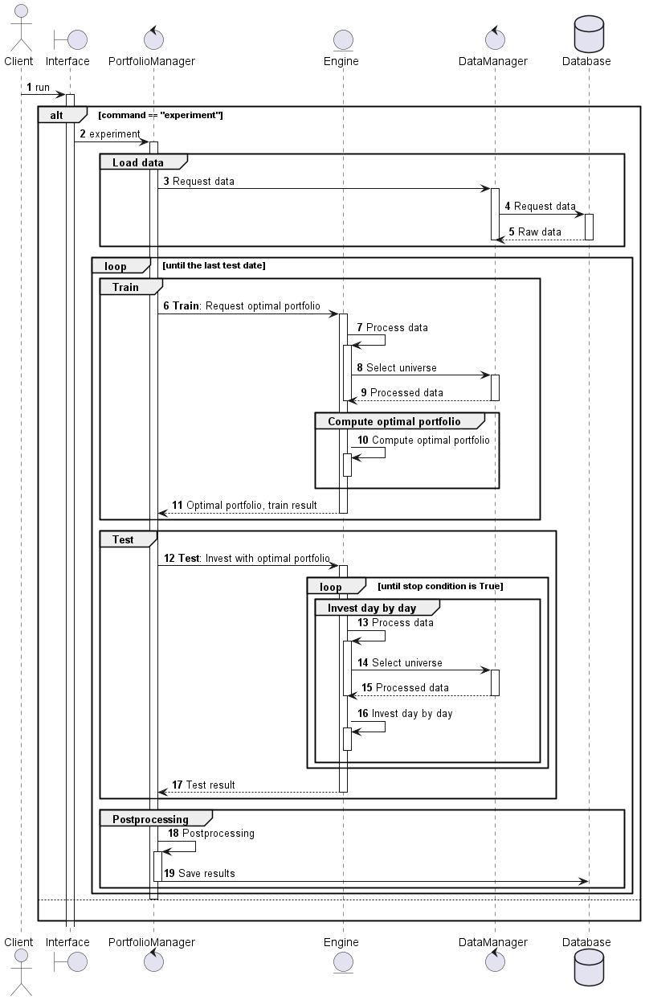

# Enhanced index tracking 
지수의 수익률을 상회하는 지수 상향 추종 포트폴리오를 선택하는 프로젝트

> **Reference**. \
[윤동진, 이주홍, 최범기, 송재원, "부분복제 지수 상향 추종을 위한 진화 알고리즘 기반 3단계 포트폴리오 선택 앙상블 학습", 스마트미디어저널, 제10권, 제3호, 39-47쪽, 2021년 9월](https://kism.or.kr/file/memoir/10_3_4.pdf)

# Sequence diagram

